# Autonomous AI Software Engineer

> A repository-aware multi-agent coding prototype that plans changes, retrieves relevant context, edits through repository-scoped tools (direct or MCP), runs tests, reviews feedback, and iterates on repairs.

The project explores whether repository-aware retrieval can improve retrieval quality enough to justify its latency overhead. Retrieval was measured independently; the end-to-end coding-agent benchmark was not run because the available Windows execution environment did not safely isolate untrusted code.

**Measured finding:** Hybrid retrieval raised MRR from 0.3390 to 0.3583, left Recall@5 and Precision@5 unchanged, and increased mean retrieval latency by roughly 35×. The autonomous coding-agent benchmark was not executed.

## Current Status

| Component | Status |
| --- | --- |
| Multi-agent orchestration | Implemented |
| Repository-scoped tools | Implemented |
| MCP tool layer | Implemented; local SDK transport has a known Windows startup issue |
| RepoMind integration | Implemented as a repository-aware retrieval adapter |
| Retrieval experiments | Measured; results and manifests included |
| End-to-end coding-agent benchmark | Designed, not executed |
| Production-grade sandboxing | Not implemented |

## Key Experimental Finding

One-run retrieval comparison on a frozen 50-query FastAPI corpus (source-level metrics, K=5):

| Metric | Vector baseline | Hybrid BM25 + dense |
| --- | ---: | ---: |
| Recall@5 | 0.3400 | 0.3400 |
| Precision@5 | 0.0920 | 0.0920 |
| MRR | 0.3390 | 0.3583 |
| nDCG@5 | 0.3031 | 0.3055 |
| Mean retrieval latency | 59.277 ms | 2075.356 ms |
| P95 retrieval latency | 68.923 ms | 2342.768 ms |

Hybrid retrieval slightly improved ranking quality (MRR and nDCG), but did not improve Recall@5 or Precision@5. Mean retrieval latency increased by roughly **35×**. This is a retrieval experiment, not an agent benchmark; it is a single run and does not measure agent tokens or cost. See [the full results and limitations](docs/retrieval-experiment-results.md).

## Why This Project?

Many coding-agent prototypes focus on the model loop. This project explores the engineering around that loop:

- Repository-aware context retrieval
- Explicit Planner, Coder, Tester, and Reviewer roles
- Bounded, repository-scoped tool access
- Test feedback and iterative repair
- Independent retrieval quality measurement
- Security analysis that stopped an unsafe benchmark run

## Architecture

```mermaid
flowchart TD
    U[User task] --> O[Orchestrator]
    O --> P[Planner]
    P -->|inspect| F[Repository file tools]
    P -. optional repository query .-> R[RepoMind service]
    R -. scoped evidence .-> P
    P --> C[Coder]
    C --> T[Direct or MCP tool provider]
    T -->|list, read, write| F
    O -->|after coding| Q[Tester]
    Q --> T
    T --> X[pytest]
    X --> Q
    Q --> V[Reviewer]
    V --> D{Approved and tests pass?}
    D -->|No, within attempt budget| C
    D -->|Yes| Z[Result]
```



RepoMind returns repository-scoped evidence to the Planner, which can include it in the structured plan passed to the Coder. The tool layer provides file listing, reading, writing, and pytest verification. There is no general-purpose shell or Git tool. `shell=False` prevents shell parsing; it does **not** sandbox Python or pytest code.

The CLI exposes `single`, `multi`, `multi-mcp`, and `multi-mcp-repomind` modes. RepoMind is a separate service: this project adapts its `POST /query` API and does not implement its ingestion or embedding pipeline. See [the integration adapter](src/flagship/repomind.py) and [the orchestrator](src/flagship/orchestration/orchestrator.py).

## Engineering Decisions

1. **Provider abstraction:** Model interaction is separated from orchestration, while tool providers can route calls directly or through MCP.
2. **Repository-scoped tools:** File operations resolve paths against the selected repository root and reject paths outside it. This is an application-level boundary, not an OS sandbox.
3. **MCP integration:** Local MCP mode connects the tool server and client in-process; a stdio client is also available. The MCP layer structures tool access but does not isolate code execution.
4. **Test-driven repair:** The orchestrator runs pytest and gives test or reviewer feedback to the Coder within a configured attempt budget.
5. **Independent retrieval evaluation:** Retrieval experiments report Recall@K, Precision@K, MRR, nDCG, and latency separately from coding-agent performance.
6. **Security-first benchmark decision:** The benchmark was not run after the audit found that the Windows environment did not isolate generated code from host resources or protect evaluator logic.

## Example Execution Flow

**Conceptual flow, not a recorded model run:**

`Task → Planner → optional RepoMind evidence → Coder → repository tools → pytest → Reviewer → repair feedback if needed`

The repository includes a deterministic orchestration smoke test in [`tests/test_benchmark_smoke.py`](tests/test_benchmark_smoke.py). It uses a scripted model and fake MCP client, while running pytest against a temporary repository. Its assertions verify that the C and D orchestration paths complete, that only D makes a scoped retrieval call, and that D's retrieved evidence reaches the Coder. This validates test machinery; it is not a live model run, an actual MCP SDK transport test, or benchmark evidence.

## Evaluation Status

### Retrieval evaluation: completed

Two single-run retrieval experiments are documented: a vector baseline and hybrid BM25 + dense retrieval. Their reports, per-query results, and manifests are included under [`docs/results/`](docs/results/README.md).

### Autonomous coding benchmark: designed but not executed

The draft benchmark includes 24 task records and four synthetic repositories. Its design specifies four controlled CLI variants, a deterministic counterbalanced schedule, hidden evaluator behavior, and telemetry fields. Private evaluator and reference-fix files are excluded from the public repository. **No autonomous coding benchmark results are reported because the available execution environment did not provide sufficient isolation for safe evaluation.** No agent success rate or agent token/cost efficiency is claimed.

## Security Finding

The prototype's repository-root path checks are application-level controls, not an operating-system sandbox. The audit demonstrated that code executed through pytest could access resources available to the Windows user and inherited environment. Therefore the end-to-end benchmark was intentionally **not executed**. See the [isolation audit](docs/benchmark-isolation-security-audit.md).

The proposed future boundary uses an ephemeral Linux worker with no host mounts and restricted or disabled network egress. Model and RepoMind access would go through controller-side brokers; evaluator logic would remain in the controller and communicate with the isolated candidate through a narrow interface. This architecture is a design, not an implemented or validated security feature; details are in [the secure evaluation design](docs/benchmark-secure-evaluation-architecture.md).

Do not use this prototype to execute untrusted repositories on a personal or controller host. The Reviewer is model-driven, not a correctness proof; local MCP mode has no authentication or distributed deployment setup.

## Reproducibility

The retrieval reports, result artifacts, and manifests are included. They contain hashes and experiment configuration, but the complete evaluation query set, evaluator implementation, and RepoMind source/runtime environment are not included in this public repository. Full independent reproduction from a fresh clone is therefore currently limited. These retrieval measurements do not measure coding-agent task success, token usage, or cost. The autonomous coding benchmark itself was not executed.

## Installation and Use

Requires Python 3.12 or newer.

```bash
python -m venv .venv
# Windows PowerShell: .venv\Scripts\Activate.ps1
# macOS/Linux: source .venv/bin/activate
python -m pip install -e ".[dev,mcp]"
```

Set `OPENAI_API_KEY` in the shell or a secret manager for live model calls. The application does not load `.env` files. `.env.example` contains blank credential placeholders; never put real credentials there.

| Variable | Default | Purpose |
| --- | --- | --- |
| `OPENAI_API_KEY` | — | Required for live model calls |
| `FLAGSHIP_MODEL` | `gpt-5` | Responses API model name |
| `FLAGSHIP_MAX_TOOL_CALLS` | `20` | Shared tool-call limit |
| `FLAGSHIP_MAX_REPAIR_ATTEMPTS` | `2` | Verification/repair retries |
| `FLAGSHIP_MAX_CODING_ATTEMPTS` | `3` | Maximum multi-agent coding attempts |
| `FLAGSHIP_TEST_TIMEOUT_SECONDS` | `120` | pytest timeout |
| `REPOMIND_BASE_URL` | — | RepoMind service URL for RepoMind mode |
| `REPOMIND_REPOSITORY_ID` | — | Explicit repository UUID for retrieval scope |
| `REPOMIND_TIMEOUT_SECONDS` | `15` | RepoMind HTTP request timeout |

Example commands:

```bash
flagship run --mode single --task "Add input validation" --repo ./my-repo
flagship run --mode multi --task "Add input validation" --repo ./my-repo
flagship run --mode multi-mcp --task "Fix failing tests" --repo ./my-repo --test-command "pytest -q"
flagship run --mode multi-mcp-repomind --task "Find and fix the parser bug" --repo ./my-repo --repository-id 00000000-0000-0000-0000-000000000000 --repomind-base-url http://127.0.0.1:8000
```

RepoMind mode requires a service URL and explicit repository UUID. Each retrieval request must carry the same repository ID; missing or mismatched scope is rejected. A configured test command must begin with `pytest`; otherwise the application invokes `python -m pytest` in the target repository.

## Tests

The ordinary unit tests use mocked models and temporary repositories and do not need an API key or live RepoMind service. A live RepoMind smoke test is opt-in. The MCP SDK test path is known to hang during Windows asyncio socket-pair startup, so the public CI suite excludes it. CI also excludes private-fixture validation that requires unpublished evaluator assets and nested fixture Git histories.

Run the safe deterministic suite from PowerShell:

```powershell
$env:PYTHONDONTWRITEBYTECODE = '1'
$env:PYTHONPATH = (Join-Path (Get-Location).Path 'src')
python -m pytest -p no:cacheprovider --basetemp .pytest-tmp tests/test_agent.py tests/test_file_tools.py tests/test_benchmark_harness.py tests/test_benchmark_smoke.py tests/test_local_benchmark_corpus.py::test_draft_has_unique_task_ids_and_four_variants tests/test_local_benchmark_corpus.py::test_draft_task_records_load_through_the_real_harness_schema tests/test_local_benchmark_corpus.py::test_evaluators_and_reference_fixes_never_appear_in_task_prompts tests/test_local_benchmark_corpus.py::test_repository_source_contains_no_seed_comments_that_give_away_defects tests/test_local_benchmark_corpus.py::test_manifest_sha_is_exact_and_repeatable tests/test_local_benchmark_corpus.py::test_category_difficulty_and_retrieval_labels_are_valid tests/test_model.py tests/test_multi_agent.py tests/test_repomind.py tests/test_shell_tools.py -k "not real_local_baseline_can_be_materialized_from_draft_manifest" -q
```

This command does not run a real benchmark task or make LLM calls. Do not treat corpus validation or the deterministic orchestration smoke test as end-to-end agent benchmark results.

## Project Structure

```text
src/       Agent roles, orchestration, tools, MCP, and RepoMind adapter
tests/     Unit and integration tests
benchmark/ Draft task corpus, harness, and synthetic repositories
docs/      Design, validation, retrieval results, and security records
.github/   Continuous integration workflow
README.md  Project overview and measured results
pyproject.toml  Package metadata and development dependencies
```

The four repositories in `benchmark/repositories/` are synthetic fixtures published as ordinary source and test directories without nested Git history. The public task manifest is a draft; private evaluator/reference assets are not included because they contain oracle information.

## Future Work

1. Build and validate isolated Linux infrastructure before any agent benchmark execution.
2. Repeat retrieval experiments to estimate run-to-run variance.
3. Add and validate token/cost telemetry for future agent evaluation.
4. Add Linux CI coverage for the MCP SDK transport.
5. Evaluate on a broader set of real-world repositories after isolation is established.

## What I Would Discuss in an Interview

- Why repository-aware retrieval may help coding agents, and what these experiments did and did not establish.
- Why hybrid retrieval did not improve Recall@5 in this run.
- Why hybrid mean latency rose to roughly 35 times the vector baseline.
- How the Planner/Coder/Tester/Reviewer loop passes test and review feedback into repair attempts.
- Why the benchmark was stopped on security grounds instead of reporting unsupported results.
