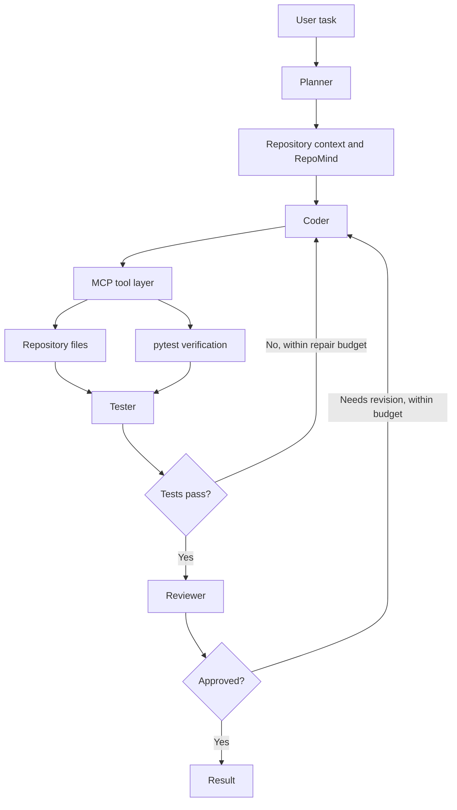

# Autonomous AI Software Engineer

An autonomous, repository-aware AI software engineer prototype that combines repository context and retrieval with a Planner, Coder, Tester, and Reviewer. It edits through bounded tools, runs pytest verification, reviews the result, and can iteratively repair failures.

The project asks: **Does repository-aware retrieval improve a small multi-agent coding system, and is any improvement worth its token and latency cost?** Retrieval experiments were conducted; the final end-to-end agent benchmark was deliberately not run after a security audit found that the local Windows execution model could not isolate untrusted generated code.

## Project status

| Area | Status |
| --- | --- |
| Multi-agent coding prototype | Implemented; model-driven behavior is not claimed as benchmarked |
| RepoMind integration and retrieval/evaluation infrastructure | Implemented as a prototype |
| Retrieval Experiments 0 and 1 | Measured; reports, result artifacts, and manifests are included in [experiment results](docs/retrieval-experiment-results.md) |
| 24-task autonomous coding benchmark | Designed and oracle-validated; end-to-end LLM run **not executed** |
| Benchmark security | Current execution model found insufficiently isolated; findings are preserved in the [security audit](docs/benchmark-isolation-security-audit.md) |

## Architecture



The project has four modes: `single`, `multi`, `multi-mcp`, and `multi-mcp-repomind`. The multi-agent flow uses Planner/Coder/Tester/Reviewer roles coordinated by an Orchestrator with bounded tool calls and repair attempts. The Planner can inspect repository files and, in RepoMind mode, request retrieved evidence; evidence is included in the structured plan for the Coder.

RepoMind is a separate retrieval service. The flagship adapter calls its `POST /query` endpoint and turns results into structured tool data. RepoMind owns ingestion, embedding, and retrieval; this repository does not embed its implementation. Experiment 1 evaluated hybrid BM25+dense retrieval and found a modest ranking improvement, no Recall@5 improvement, and a dramatic latency increase. See the results document for the provenance limitation.

The MCP layer exposes `list_files`, `read_file`, `write_file`, and `run_tests`. Local CLI runs use the official MCP SDK's in-process client/server connection; an SDK stdio client is also available. Direct modes use the same tools through a direct provider. There is no general-purpose shell tool. The test tool accepts pytest commands and uses `shell=False`, but that does not sandbox code executed by pytest.

## Installation

Requires Python 3.12 or newer.

```bash
python -m venv .venv
# Windows PowerShell: .venv\Scripts\Activate.ps1
# macOS/Linux: source .venv/bin/activate
python -m pip install -e ".[dev,mcp]"
```

Set `OPENAI_API_KEY` in the shell or a secret manager for live model calls. The application does not load `.env` files. `.env.example` lists settings with blank credential placeholders; never put real credentials there.

| Variable | Default | Purpose |
| --- | --- | --- |
| `OPENAI_API_KEY` | — | Required for live model calls |
| `FLAGSHIP_MODEL` | `gpt-5` | Responses API model name |
| `FLAGSHIP_MAX_TOOL_CALLS` | `20` | Shared tool-call limit |
| `FLAGSHIP_MAX_REPAIR_ATTEMPTS` | `2` | Verification/repair retries |
| `FLAGSHIP_TEST_TIMEOUT_SECONDS` | `120` | pytest timeout |
| `REPOMIND_BASE_URL` | — | RepoMind service URL for RepoMind mode |
| `REPOMIND_REPOSITORY_ID` | — | Explicit repository UUID for retrieval scope |
| `REPOMIND_TIMEOUT_SECONDS` | `15` | RepoMind HTTP request timeout |

## Run a task

```bash
flagship run --mode single --task "Add input validation" --repo ./my-repo
flagship run --mode multi --task "Add input validation" --repo ./my-repo
flagship run --mode multi-mcp --task "Fix failing tests" --repo ./my-repo --test-command "pytest -q"
flagship run --mode multi-mcp-repomind --task "Find and fix the parser bug" --repo ./my-repo --repository-id 00000000-0000-0000-0000-000000000000 --repomind-base-url http://127.0.0.1:8000
```

RepoMind mode requires a service URL and explicit repository UUID. Each retrieval request must carry the same repository ID; missing or mismatched scope is rejected. The optional verification command must begin with `pytest`; otherwise the app invokes `python -m pytest` in the target repository.

## Results and evaluation

### Measured retrieval experiments

Experiment 0 used baseline vector retrieval. Experiment 1 used hybrid BM25+dense retrieval. The recorded single-run results show modest ranking gains, no improvement in Recall@5 or Precision@5, and a very large latency cost. The [experiment results document](docs/retrieval-experiment-results.md) summarizes the exact metrics and links to the copied reports, JSON results, and manifests. Retrieved source-text excerpts are omitted from the public JSON artifacts; query, ranking, and metric fields are unchanged.

### Autonomous coding benchmark: not executed

The 24-task draft corpus and four synthetic repositories are included in the public source tree. Hidden evaluators, reference fixes, and raw per-task validation output remain private and are excluded because they could disclose oracle behavior. Public design notes retain only a high-level corpus-validation summary. Corpus validation is not an agent result: no A/B/C/D end-to-end LLM benchmark run was performed, no agent success rate is available, and the benchmark remains unfrozen. The run was deferred because the Windows host could not isolate agent-generated code from controller-owned files, while hidden evaluator code imported candidate code in the same interpreter. See the [isolation audit](docs/benchmark-isolation-security-audit.md) and [proposed secure evaluation architecture](docs/benchmark-secure-evaluation-architecture.md).

## Security boundaries and limitations

Repository path checks constrain the specific file tools; they are not an operating-system security boundary. pytest executes repository code with the current user's permissions and inherited environment. Do not use this prototype to execute untrusted repositories on a personal or controller host. The benchmark must not be run until a disposable Linux worker/CI boundary and controller-side evaluator/candidate process separation have been designed and validated. The proposed architecture uses no host mounts, restricted or disabled candidate network egress, controller-side model and RepoMind brokers, one-way artifact transfer, and a narrow controller-owned evaluator interface that queries the isolated candidate without importing its code.

Other limitations: the Reviewer is model-driven rather than a correctness proof; MCP local mode has no authentication or distributed deployment setup; RepoMind's service must be deployed accordingly. This is a portfolio prototype, not a production-ready coding system. The [security audit](docs/benchmark-isolation-security-audit.md) documents what was tested and why the benchmark was deferred.

## Tests

The ordinary unit tests use mocked models and temporary repositories and do not need an API key or live RepoMind service. A live RepoMind smoke test is opt-in and requires explicit environment settings. The MCP SDK test path is known to hang during Windows asyncio socket-pair startup on this host. The public CI suite excludes it and also excludes private-fixture validation that depends on unpublished evaluators and the fixture Git histories:

```powershell
$env:PYTHONDONTWRITEBYTECODE = '1'
$env:PYTHONPATH = (Join-Path (Get-Location).Path 'src')
python -m pytest -p no:cacheprovider --basetemp .pytest-tmp tests/test_agent.py tests/test_file_tools.py tests/test_benchmark_harness.py tests/test_benchmark_smoke.py tests/test_local_benchmark_corpus.py::test_draft_has_unique_task_ids_and_four_variants tests/test_local_benchmark_corpus.py::test_draft_task_records_load_through_the_real_harness_schema tests/test_local_benchmark_corpus.py::test_evaluators_and_reference_fixes_never_appear_in_task_prompts tests/test_local_benchmark_corpus.py::test_repository_source_contains_no_seed_comments_that_give_away_defects tests/test_local_benchmark_corpus.py::test_manifest_sha_is_exact_and_repeatable tests/test_local_benchmark_corpus.py::test_category_difficulty_and_retrieval_labels_are_valid tests/test_model.py tests/test_multi_agent.py tests/test_repomind.py tests/test_shell_tools.py -k "not real_local_baseline_can_be_materialized_from_draft_manifest" -q
```

This command does not run a real benchmark task or make LLM calls. The opt-in live RepoMind smoke test is separate. Do not treat corpus validation tests as an end-to-end benchmark.

## Repository structure

```text
src/flagship/       Agent roles, orchestration, tools, MCP, RepoMind adapter
tests/              Unit and integration tests
benchmark/          Draft task corpus, public harness scripts, synthetic fixtures
docs/               Design, validation, retrieval, and security records
```

The four repositories under `benchmark/repositories/` are synthetic fixtures included as ordinary source/test directories in the public task corpus; their nested Git histories are not included. Hidden evaluators and reference fixes are intentionally excluded because they disclose task oracles and reference solutions. The public task manifest is a draft and does not include its private oracle, so the package does not reproduce hidden-evaluator outcomes. The autonomous end-to-end LLM benchmark was **not executed**; publishing fixtures does not imply that agent benchmark results were obtained. Execution remains deferred pending secure isolation.

## Future work

- Publish provenance-backed numeric retrieval result tables and their source artifacts.
- Decide whether the benchmark and its oracle assets will remain private or be permanently public.
- Build and validate an isolated Linux worker with controller-side evaluation and one-way artifact transfer.
- Only after security validation, freeze the task set and run a preregistered end-to-end benchmark.
- Improve deployment, authentication, and retrieval evidence metadata.
